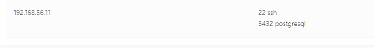
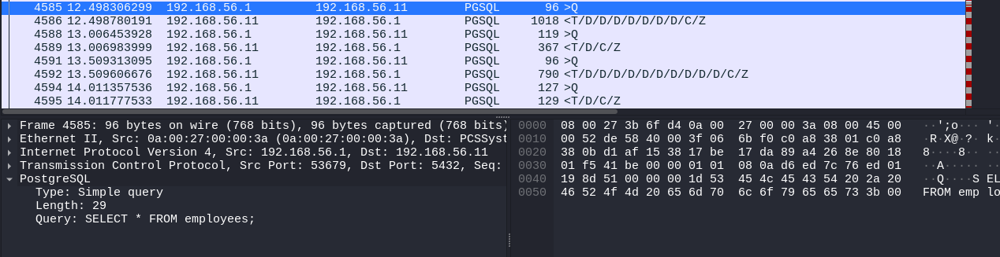

# Industrialspy 3

- Category: Forensics
- Points: 100
- Description: I welcome you to the internship program at Collective Inc. Your first task is to figure out what happened to one of our servers. We have a suspicion that someone logged in and did something. We recovered some files to help you figure this out.
If you have figured it out. Submit your report to nc challenges.ctf.compfest.id 9009.
- Author: k3ng 

## Solution

jadi ini adalah chall forensic dalam bentuk pcapng

oke jadi pertama tama kita cek dulu apa yang akan di tanya. kita coba akses nc nya

untuk mengecek open port pada pcapng file bisa menggunakan `Wireshark` atau pake website [Apackets](https://apackets.com/upload) 

untuk melakukan .pcapng analysis kita tinggal check open ports di websitenya

ada 2 doang bjirr `22` dan `5432`

keh, next pertanyaannya 

bisa kita lihat dari analisa credential di apackets, jadi teorinya kalo orang bruteforce akun hasil paling terakhir kan yang benar jadi kita tinggal liat akun terakhir di listnya

next question

ez, teorinya dia udah masuk ke databasenya kita lihat aja pakai wireshark dimana traffic yang menggunakan protocol `PGSQL` kita tinggal nguli sedikit dan dapatlah query dimana dia select table employee

kita tinggal lihat saja hasilnya password dari user "super" dan mendapatkan hash yaitu `588831adfca19bb4426334b69d9fb49f873e8a22`. dari hash identifier ini merupakan `SHA-1`

next kita nguli lagi buat decode hashnya, setelah hampir 5 jam bingung kenapa gaada web yang bisa decode akhirnya ketemu website random dan ternyata bisa decode:). (chall dukun)

hasil hash: `cafecoagroindustrialdelpacfico`

next question:

oke berarti tinggal liat lagi query yang ingin dia ubah, yaitu penalties

NEXT QUESTION:

oke teorinya dia ingin menghapus data diri dia dari table penalties dan di table penalties ada id user yang digunakan untuk menghapus datanya, tinggal kita cocokin aja dari table employee dan dapatlah nama `Lyubov Pryadko`

ez
## Flag
FLAG :  `COMPFEST16{h3lla_ez_DF1R_t4sK_f0r_4n_1nt3rN_b96818fd79}`
