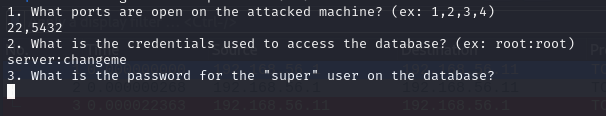
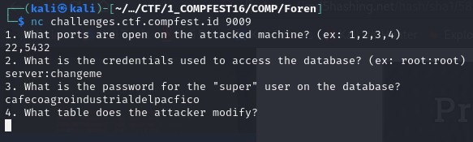

# CTF Writeup: Let's Help John!

- Kategori: Web
- Poin: 100
- Description: Oh no! My ex-cellmate got jailed again! Help me leave a key for him!
- Penulis: Ultramy

## Solution

Ini adalah tantangan web yang sederhana menggunakan **Burpsuite**.

Ketika pertama kali mengakses situs web, Anda akan melihat ini

Jadi saya klik play, duhhh

Karena dikatakan harus dirujuk dari situs resmi, saya mengubah referer menjadi `http://state.com` dalam request http

Berhasil gais, situs web berikutnya meminta kita untuk mengubah nilai cookie dari quantity dari `Limited` menjadi `Unlimited`. Jadi sekarang kita periksa saja dan lihat nilai apa yang harus diubah. Setelah kita tahu nilai apa yang ingin diubah, kita tinggal tambahkan saja ke dalam header http-nya. 

Di dalam cookie terdapat `quantity` yang memiliki nilai `Limited`. Oke, karena sekarang kita tahu apa yang harus kita ubah, tinggal kita masukkan saja valuenya dalam request http-nya

Oke, sekarang kita diminta untuk mengganti `user-agent` menjadi `AgentYessir`.

Don ges, sekarang situs web mengatakan, `"Great! To make it obvious for John, lets say it's From pinkus@cellmate.com"`. Jadi di field request http ada yang disebut `From` yang bisa kita isi dengan email. Dengan pengetahuan itu, kita masukkan saja `From: pinkus@cellmate.com` dalam requestnya.

Selesai deh...

## Flag
FLAG: `COMPFEST16{nOW_h3Lp_H1m_1n_john-O-jail-misc_8506972ce3}`